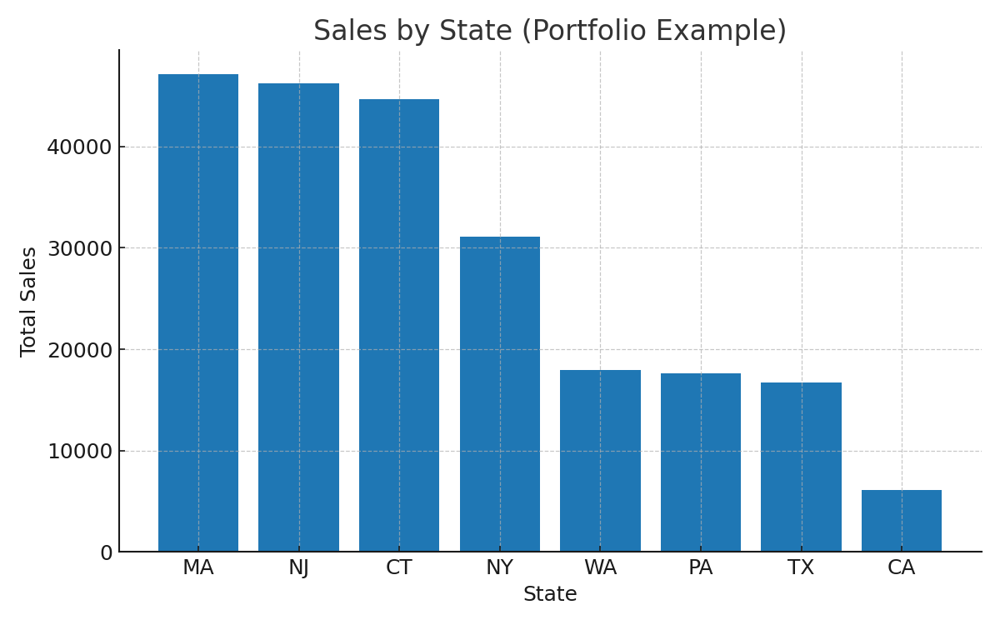
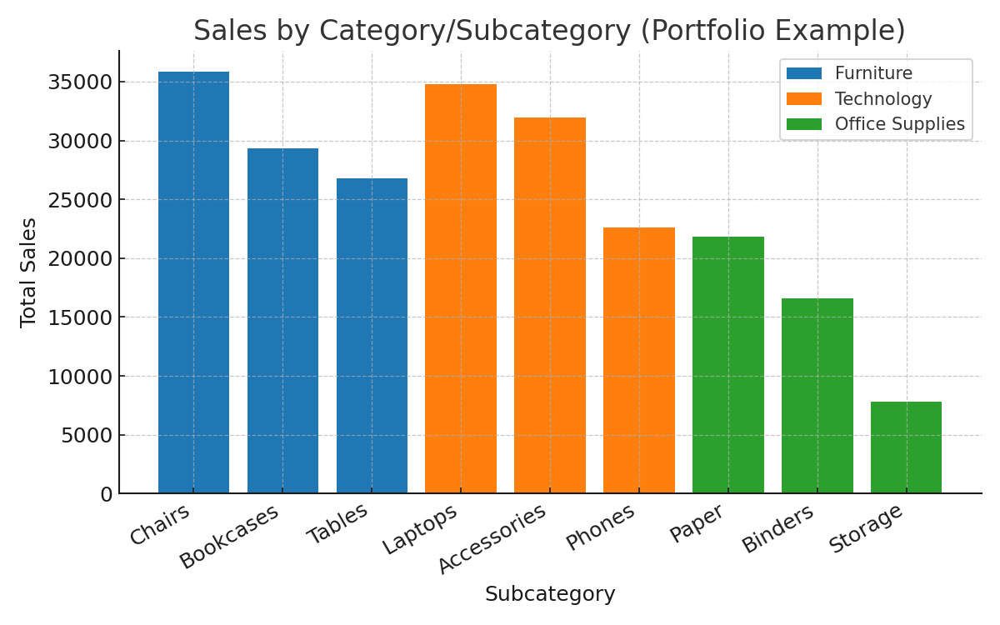
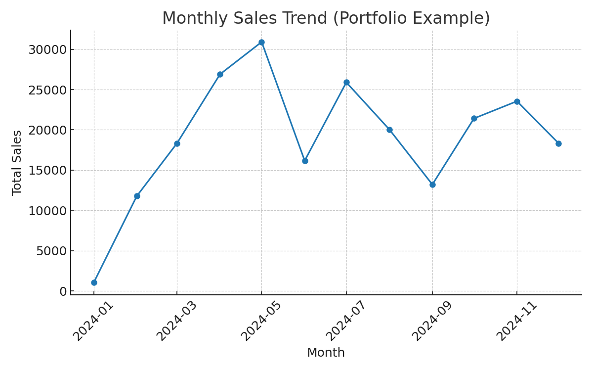

# Data Analyst Portfolio — Lokesh Potluri

Hands-on projects across **SQL, Power BI, and Python (pandas)** using a retail sales dataset.  
Focus: data cleaning, KPI design (Sales, Profit, Margin, Orders, AOV), trend analysis, and state/segment performance.

**Highlights**
- 10+ SQL analytics queries (aggregations, window functions, AOV, contribution %)
- Power BI dashboard with DAX measures (Total Sales, Profit Margin %, Orders, AOV)
- Python script that computes KPIs and plots Monthly Sales
